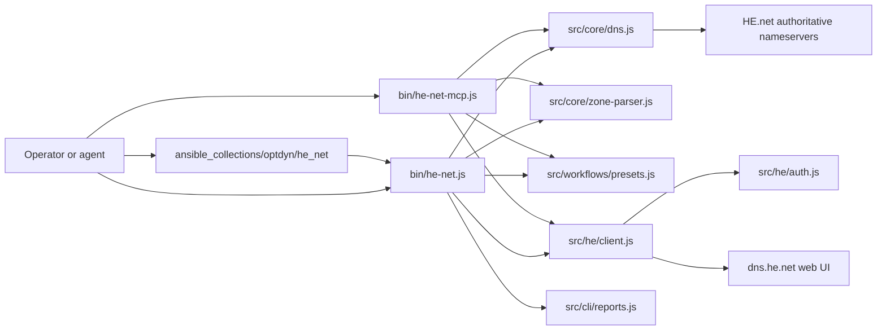
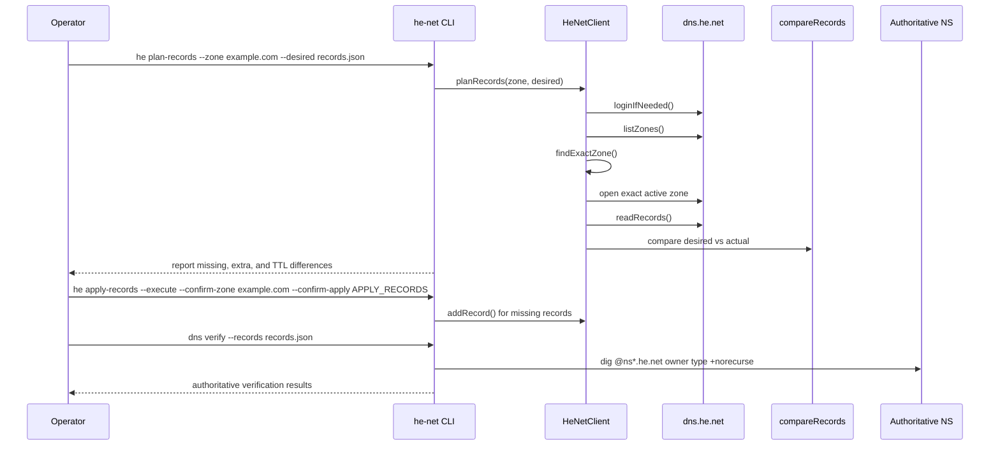

# Architecture

The toolkit is organized around a local desired-state model. Source captures
and workflow presets become structured records. Those records are compared
against HE.net UI state, optionally applied through a guarded adapter, and then
verified against authoritative nameservers.

## Component Diagram

## Mutation Sequence

> [!WARNING]
> `apply-records` currently adds missing records only. It reports extra records
> but does not remove them through the CLI.

## Core Boundaries

| Boundary | Responsibility | Files |
| --- | --- | --- |
| Core DNS logic | Normalize names, compare records, run authoritative checks | `src/core/dns.js` |
| Zone parsing | Parse raw captures, tokenize records, emit structured JSON and zone files | `src/core/zone-parser.js` |
| HE.net adapter | Log in, inspect zones, read records, add records, inspect conversion | `src/he/client.js`, `src/he/auth.js` |
| CLI | Route commands, read/write files, produce reports | `src/cli/main.js`, `src/cli/args.js`, `src/cli/reports.js` |
| Workflows | Generate desired records for known scenarios | `src/workflows/presets.js` |
| MCP | Expose safe tools over JSON-RPC stdin/stdout | `src/mcp/server.js` |
| Ansible | Call the CLI from Ansible modules and roles | `ansible_collections/optdyn/he_net` |

## Data Flow

1.  A raw zone capture or workflow preset becomes a JSON object with `origin`
    and `records`.
2.  Each record uses fields such as `owner`, `type`, `ttl`, `class`, `rdata`,
    `rdata_tokens`, and optional parsed `fields`.
3.  HE.net UI rows are read as `name`, `type`, `ttl`, `priority`, `content`,
    `recordId`, and `locked`.
4.  `compareRecords()` builds normalized keys to find missing records, extra
    records, TTL differences, and provider-managed records.
5.  Live verification calls `dig` against `ns1.he.net` through `ns5.he.net`
    unless nameservers are supplied explicitly.

